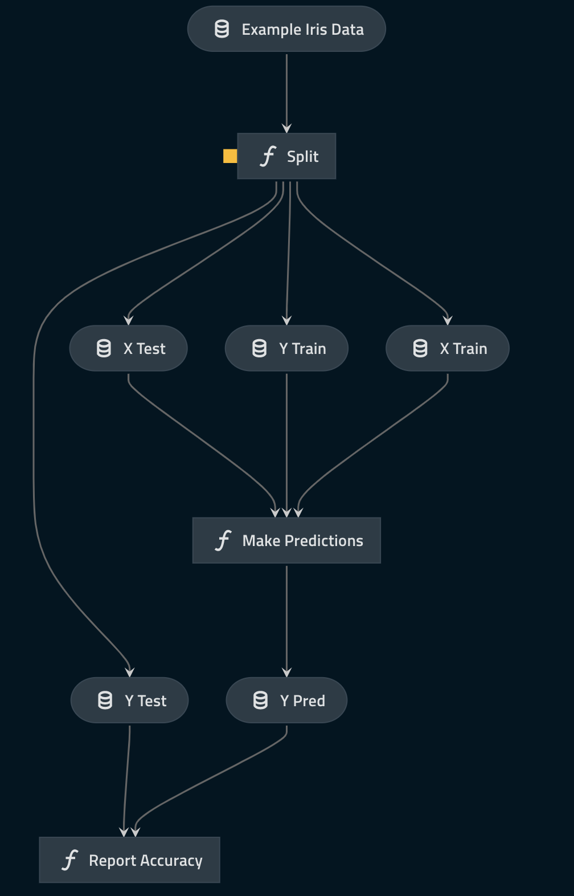

# The `databricks-iris` Kedro starter

## Introduction

The code in this repository demonstrates best practice when working with Kedro and PySpark on Databricks. It contains a Kedro starter template with some initial configuration and an example pipeline, it accompanies the documentation on [developing and deploying Kedro projects on Databricks](https://docs.kedro.org/en/stable/integrations/index.html#databricks-integration).

This repository is a fork of the `pyspark-iris` starter that has been modified to run natively on Databricks.

## Getting started

The starter template can be used to start a new project using the [`starter` option](https://docs.kedro.org/en/stable/kedro_project_setup/starters.html) in `kedro new`:

```bash
kedro new --starter=databricks-iris
```

## Features

### Configuration for Databricks in `conf/base`

This starter has a base configuration that allows it to run natively on Databricks. Directories to store data and logs still need to be manually created in the user's Databricks DBFS instance:

```bash
/dbfs/FileStore/iris-databricks/data
/dbfs/FileStore/iris-databricks/logs
```

See the documentation on deploying a packaged Kedro project to Databricks for more information.

### Databricks entry point

The starter contains a script and an entry point (`databricks_run.py`) that enables a packaged project created with this starter to run on Databricks. See the documentation on deploying a packaged Kedro project to Databricks for more information.

### Single configuration in `/conf/base/spark.yml`

While Spark allows you to specify many different [configuration options](https://spark.apache.org/docs/latest/configuration.html), this starter uses `/conf/base/spark.yml` as a single configuration location.

### `SparkSession` initialisation

This Kedro starter contains the initialisation code for `SparkSession` in the `ProjectContext` and takes its configuration from `/conf/base/spark.yml`. Modify this code if you want to further customise your `SparkSession`, e.g. to use [YARN](https://hadoop.apache.org/docs/current/hadoop-yarn/hadoop-yarn-site/YARN.html).

### Configures `MemoryDataSet` to work with Spark objects

Out of the box, Kedro's `MemoryDataSet` works with Spark's `DataFrame`. However, it doesn't work with other Spark objects such as machine learning models unless you add further configuration. This Kedro starter demonstrates how to configure `MemoryDataSet` for Spark's machine learning model in the `catalog.yml`.

> Note: The use of `MemoryDataSet` is encouraged to propagate Spark's `DataFrame` between nodes in the pipeline. A best practice is to delay triggering Spark actions for as long as needed to take advantage of Spark's lazy evaluation.

### An example machine learning pipeline that uses only `PySpark` and `Kedro`



This Kedro starter uses the simple and familiar [Iris dataset](https://www.kaggle.com/uciml/iris). It contains the code for an example machine learning pipeline that runs a 1-nearest neighbour classifier to classify an iris.
[Transcoding](https://kedro.readthedocs.io/en/stable/data/data_catalog.html#transcoding-datasets) is used to convert the Spark Dataframes into pandas DataFrames after splitting the data into training and testing sets.

The pipeline includes:

* A node to split the data into training dataset and testing dataset using a configurable ratio
* A node to run a simple 1-nearest neighbour classifier and make predictions
* A node to report the accuracy of the predictions performed by the model
