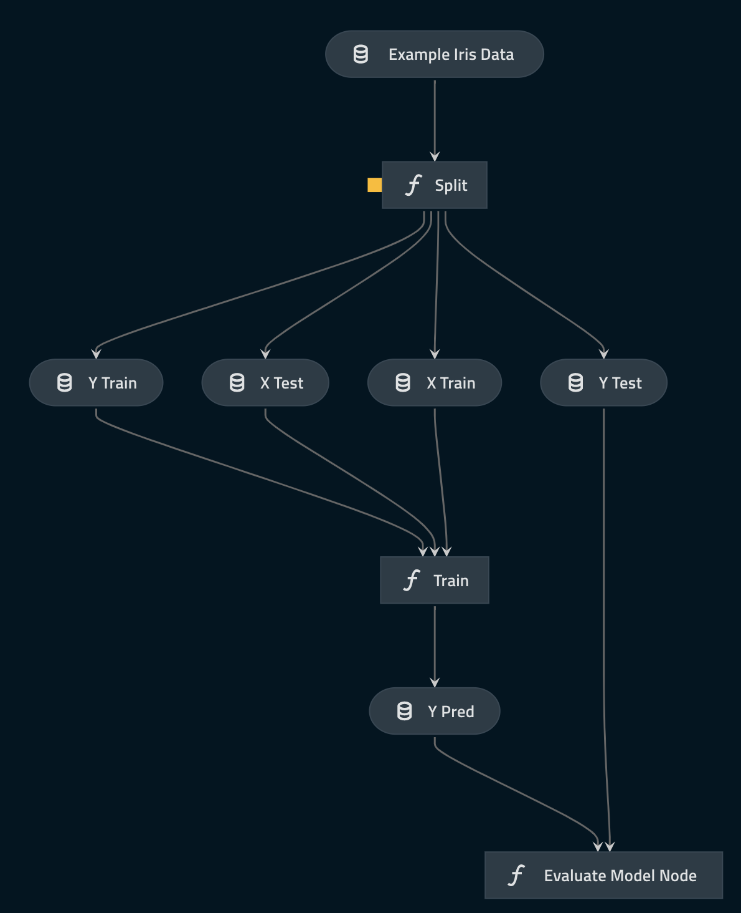

# The `pandas-iris` Kedro starter

## Introduction

The code in this repository demonstrates best practice when working with Kedro. It contains a Kedro starter template with some initial configuration and an example pipeline, and originates from the [Kedro Iris dataset example](https://docs.kedro.org/en/stable/get_started/new_project.html).

### An example pipeline using only native `Kedro`

This Kedro starter uses the simple and familiar [Iris dataset](https://www.kaggle.com/uciml/iris). It contains the code for an example machine learning pipeline that runs a 1-nearest neighbour classifier to classify an iris. 

The pipeline includes:

* A node to split the data into training dataset and testing dataset using a configurable ratio
* A node to run a simple 1-nearest neighbour classifier and make predictions
* A node to report the accuracy of the predictions performed by the model
