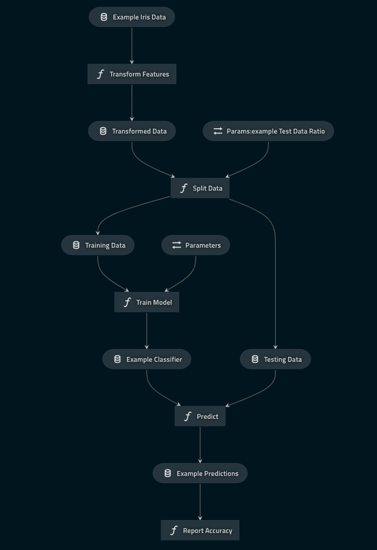

# The `pyspark-iris` Kedro starter

## Introduction

The code in this repository demonstrates best practice when working with Kedro and PySpark. It contains a Kedro starter template with some initial configuration and an example pipeline, and originates from the [Kedro documentation about how to work with PySpark](https://kedro.readthedocs.io/en/stable/11_tools_integration/01_pyspark.html).

## Getting started

The starter template can be used to start a new project using the [`starter` option](https://kedro.readthedocs.io/en/stable/02_get_started/06_starters.html) in `kedro new`:

```bash
kedro new --starter=pyspark-iris
```

As a reference, the [How to use Kedro on a Databricks cluster](https://github.com/quantumblacklabs/kedro/blob/develop/docs/source/10_deployment/08_databricks.md) tutorial bootstraps the project using this starter.

## Features

### Single configuration in `/conf/base/spark.yml`

While Spark allows you to specify many different [configuration options](https://spark.apache.org/docs/latest/configuration.html), this starter uses `/conf/base/spark.yml` as a single configuration location.

### `SparkSession` initialisation

This Kedro starter contains the initialisation code for `SparkSession` in the `ProjectContext` and takes its configuration from `/conf/base/spark.yml`. Modify this code if you want to further customise your `SparkSession`, e.g. to use [YARN](https://hadoop.apache.org/docs/current/hadoop-yarn/hadoop-yarn-site/YARN.html).

### Configures `MemoryDataSet` to work with Spark objects
Out of the box, Kedro's `MemoryDataSet` works with Spark's `DataFrame`. However, it doesn't work with other Spark objects such as machine learning models unless you add further configuration. This Kedro starter demonstrates how to configure `MemoryDataSet` for Spark's machine learning model in the `catalog.yml`.

> Note: The use of `MemoryDataSet` is encouraged to propagate Spark's `DataFrame` between nodes in the pipeline. A best practice is to delay triggering Spark actions for as long as needed to take advantage of Spark's lazy evaluation.

### An example machine learning pipeline that uses only `PySpark` and `Kedro`



This Kedro starter uses the simple and familiar [Iris dataset](https://www.kaggle.com/uciml/iris). It contains the code for an example machine learning pipeline that trains a random forest classifier to classify an iris. 

The pipeline includes two modular pipelines: one for data engineering and one for data science.

The data engineering pipeline includes:

* A node to transform multiple features into a single-column features vector using `VectorAssembler`, as well as convert a textual representation of the label column into a numerical one using `StringIndexer`
* A node to split the transformed data into training dataset and testing dataset using a configurable ratio

The data science pipeline includes:

* A node to train the random forest classifier using `pyspark.ml.classification.RandomForestClassifier`
* A node to make predictions using this classifier on the testing dataset
* A node to evaluate the model based on its predictions using `pyspark.ml.evaluation.MulticlassClassificationEvaluator`
